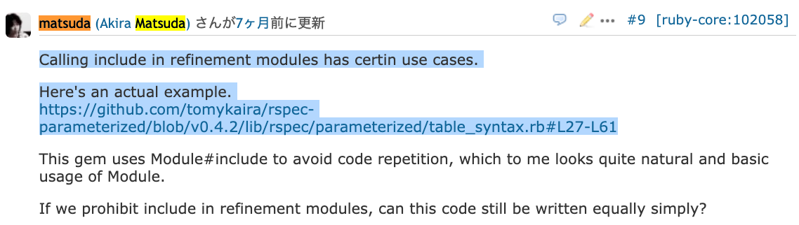

# include/prepend in refinements should be prohibited


Network Applied Communication Laboratory

Shugo Maeda

## Self introduction

* Shugo Maeda
* Ruby committer
* Creator of Textbringer
* Director at Network Applied Communication Laboratory Ltd.
* Secretary General at Ruby Association

## Sapporo RubyKaigi 2012


## Yamame in Shimane 2021 (farm raised?)


## Yamame in Shimane 2021 (wild?)


## Gogi (Iwana) in Shimane 2021 (Iwana)


## Low waterfall


## High waterfall


## What are Refinements?

* Limited monkey patching

## Example

```ruby
def foo
  p 1 / 2
end

module IntegerDivExt
  refine Integer do
    def /(other) quo(other) end
  end
end

p 1 / 2 #=> 0
using IntegerDivExt
p 1 / 2 #=> (1/2)
foo     #=> 0
```

## include/prepend in refinements

* Used for implementation sharing

## Example

```ruby
module DivExt
  module DivByQuo
    def /(other) quo(other) end
  end

  refine Integer do
    include DivByQuo
  end

  refine MyInteger do
    include DivByQuo
  end
end
```

## Problem

* Refinements don't affect included modules
* Refinments affect only:
    * scope where using is called
    * blocks for Module#refine
* Because scope of refinements should be limited lexically
* However, it's confusing...

## Bug #17007: Refined methods aren't visible from a refinement's module

```ruby
class Foo
  module Extension
    module Implementation
      def foo
        super(bar) # << Can not see bar
      end

      def bar # << Bar is in the same module!
        42
      end
    end

    refine Foo do
      prepend Implementation
    end
  end

  def foo(value = :none)
    p value
  end
end

Foo.new
Foo.new.foo # => :none (ok)

# Does not work: undefined local variable or method `bar'
using Foo::Extension
Foo.new.foo rescue :error # => :error

# Works:
Foo.prepend Foo::Extension::Implementation
Foo.new.foo # => 42
```

## Implementation difficulties

* include/prepend in refinements don't work in corner cases
* super, inline cache, etc...

## Bug #17007: SystemStackError when using super inside Module included and lexically inside refinement

```ruby
class C
  def foo
    ["C"]
  end
end

refinement = Module.new do
  R = refine C do
    def foo
      ["R"] + super
    end

    include Module.new {
      def foo
        ["M"] + super
      end
    }
  end
end

using refinement
p C.new.foo #=> SystemStackError
```

## Bug #17379: Refinement with modules redefinition bug

```ruby
def foo
  [:base]
end

module M
  def foo
    super << :M
  end
end

module Ext
  refine Object do
    include M
  end
end

using Ext

p 'asd'.foo unless ENV['SKIP'] # => [:base, :M] (ok)

module M
  def foo
    super << :new_ref
  end
end

p 'asd'.foo # => depends (not ok)
```

## Solution

* Prohibit include/prepend in refinements!

## Details

* Add a new class Refinement for refinement modules
* Refinement is a Module
* Remove Refinement#{include,prepend}
    * Deprecated warnings in Ruby 3.1
* Add Refinement#import as an alternative feature

## Refinement#import

* Copy methods of a module into the receiver
* Refinements are activated in the copied methods

## Example

```ruby
module DivExt
  module DivByQuo
    def /(other) quo(other) end
  end

  refine Integer do
    import DivByQuo
  end

  refine MyInteger do
    import DivByQuo
  end
end
```

## Why copy?

* Refinements should be limited lexically
* If we need different refinements, we need different lexical scopes
* Implementation reason: inline cache

## Limitations

* Constants
* Only Ruby methods
* Only directly defined methods

## Constants

* Constants are not imported
* Imported methods can access constants in the original context only
    * i.e., they cannot access constants of the refinement

## Constants of a refinement?

```ruby
module A
  refine String do
    X = 1 # not defined in the refinement, but in A
  end
end
```

## Only Ruby methods

```ruby
module A
  refine Integer do
    include Enumerable #=> ArgumentError
    # Should it copy C methods without refinements modification?
  end
end
```

## Only directly define methods

```ruby
module A
  def foo; puts "foo" end
end

module B
  def bar; puts "bar" end
end

module C
  refine Integer do
    import B
    # Should it copy A#foo?
  end
end

using C
1.bar #=> bar
1.foo #=> NoMethodError
```

## Use case in a real-world application



## Can Refinement#import be used instead?

```ruby
module TableSyntax
  refine Object do
    include TableSyntaxImplement
  end

  if Gem::Version.create(RUBY_VERSION) >= Gem::Version.create("2.4.0")
    refine Integer do
      include TableSyntaxImplement
    end
  else
    refine Fixnum do
      include TableSyntaxImplement
    end

    refine Bignum do
      include TableSyntaxImplement
    end
  end
```    

## NO!!!

```ruby
module TableSyntaxImplement
  extend BindingNinja

  def |(where_binding, other)
    ...
  end
  auto_inject_binding :|
end
```

## What is auto_inject_binding?

* Written in C (or Java)
* Prepend a module to pass caller bindings
* Recall the following limitations of Refinement#import
    * Only Ruby methods
    * Only directly define methods

## How to help rspec-parameterized

* Should Refinement#import copy C methods without refinements modification?
    * alias_method_chain can be used instead of prepend
* Or dirty code for a dirty job:
  `Module.instance_method(:include).bind(self).call(TableSyntaxImplement)`

## Summary

* include/prepend in refinements will be prohibited
* Refinement#import will be introduced instead
* rspec-parameterized may die

## Thank you!

* Any questions?
* Feedback is welcome at https://bugs.ruby-lang.org/issues/17429
